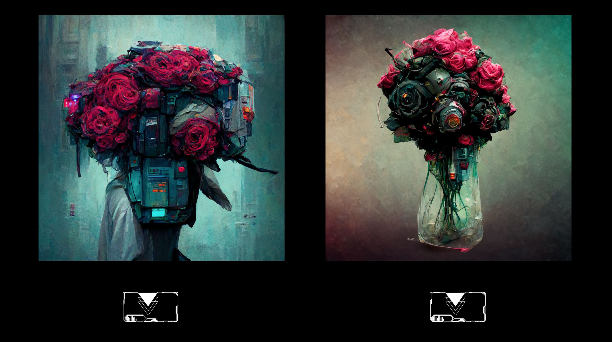
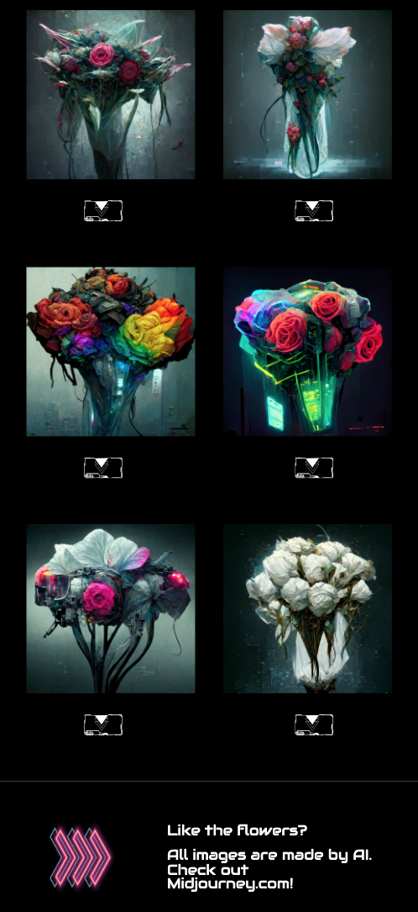

# Cyber Rose 

## A Digital Flower Galery

Hello there! 👋

Cyber Rose is a digital flower gallery inspired by a Cyberpunk theme. You can send a Cyber Rose to someone via email. 
The website's design was created using Figma. The roses galery was created by a AI (Midjourney.com).

The intention of this projected was to do a quick experiment with HTML, CSS and JS.

  

## How to use it

It's easy as 1-2-3 to send a Cyber Rose:

**1.** Select a flower you like by clicking on the button below it. It will automatically open your default email client; 
**2.** Add the email address of the recipent in the "To:" field; 
**3.** Personalize subject and message as your wish and press send.

## Go mobile

Cyber Rose layout style was also designed to support mobile.

  

## Projet's Structure

>Conceptual design of the website and project 
>Designing the website structure using Figma 
>Creation of the images using AI for key visual resources 
>Selection of Brand colors 
>Designing the logo using Canva.com 
>Adding text content and images for the main page in a coherent HTML structure 
>Applying the style to the main page 
>Creating a diferent html page for each flower 
>Applying and recycling a diferent style for the selected flower page 
>Adding button functionality 
>Bringin the website live, using Netlify 
>Adding hyperlinks to the email template 

